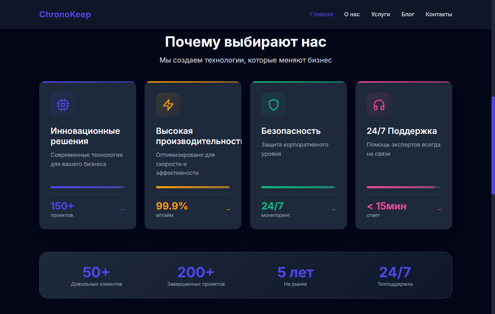
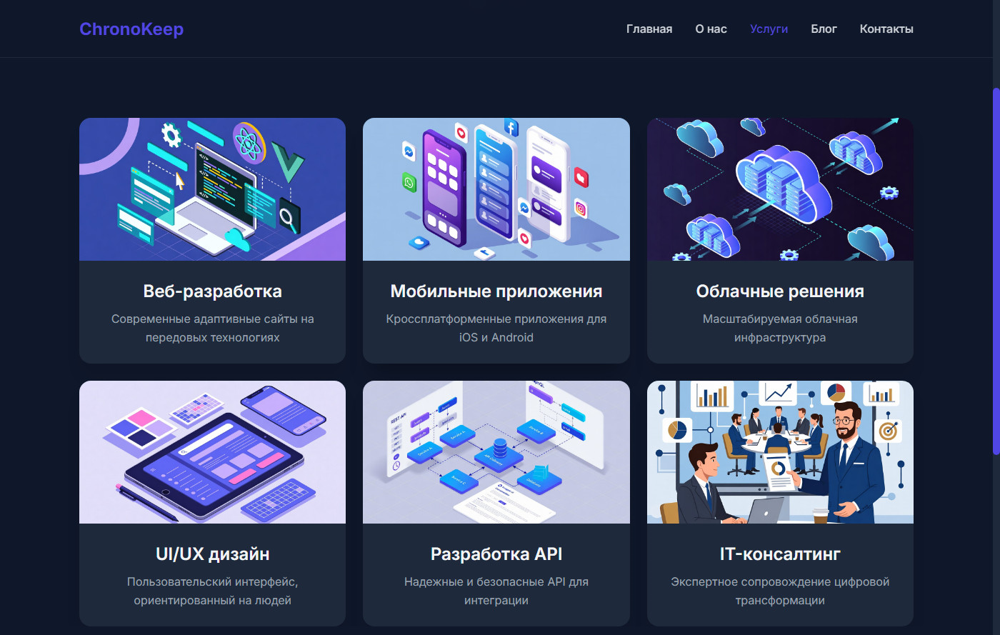
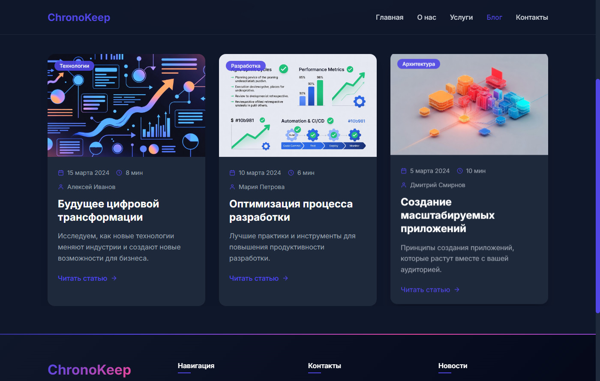
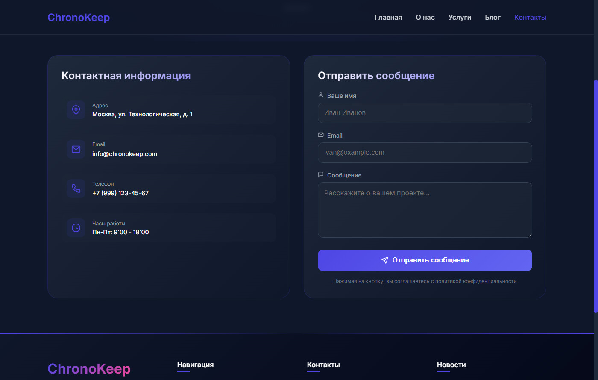
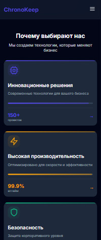
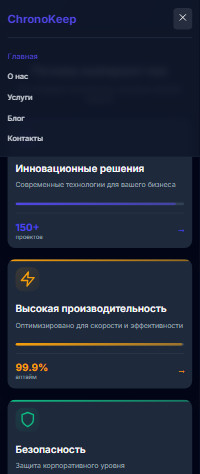

# 🚀 ChronoKeep - IT-компания


## 📸 Скриншоты

### Десктоп версия

| Главная страница | Услуги |
|-----------------|--------|
|  |  |

| Блог | Контакты |
|------|----------|
|  |  |

### Мобильная версия

| Главная (мобильная) | Бургер-меню |
|---------------------|-------------|
|  |  |

## 🚀 Демо

[Посмотреть демо](https://semeeensemeeenov23.github.io/chronokeep-redesign/)

## 📱 Функционал

- ✅ Главная страница с Hero-секцией и преимуществами
- ✅ Страница "О нас" с миссией и командой
- ✅ Страница "Услуги" с карточками услуг
- ✅ Страница "Блог" со статьями
- ✅ Страница "Контакты" с формой обратной связи
- ✅ Адаптивный дизайн (мобильные, планшеты, десктоп)
- ✅ Бургер-меню для мобильных устройств
- ✅ Плавные анимации (Framer Motion)
- ✅ Анимированный робот-маскот с эффектом свечения
- ✅ Автоматическое обновление года в футере

## 🛠 Технологии

- **React 19** + **TypeScript**
- **Vite** - сборка
- **Tailwind CSS** - стилизация
- **React Router** - навигация
- **Framer Motion** - анимации
- **React Icons** - иконки

## 📦 Установка и запуск

```bash
# Клонировать репозиторий
git clone https://github.com/ваш-username/chronokeep-redesign.git

# Перейти в папку проекта
cd chronokeep-redesign

# Установить зависимости
npm install

# Запустить в режиме разработки
npm run dev

# Собрать для продакшена
npm run build

# Предпросмотр сборки
npm run preview
